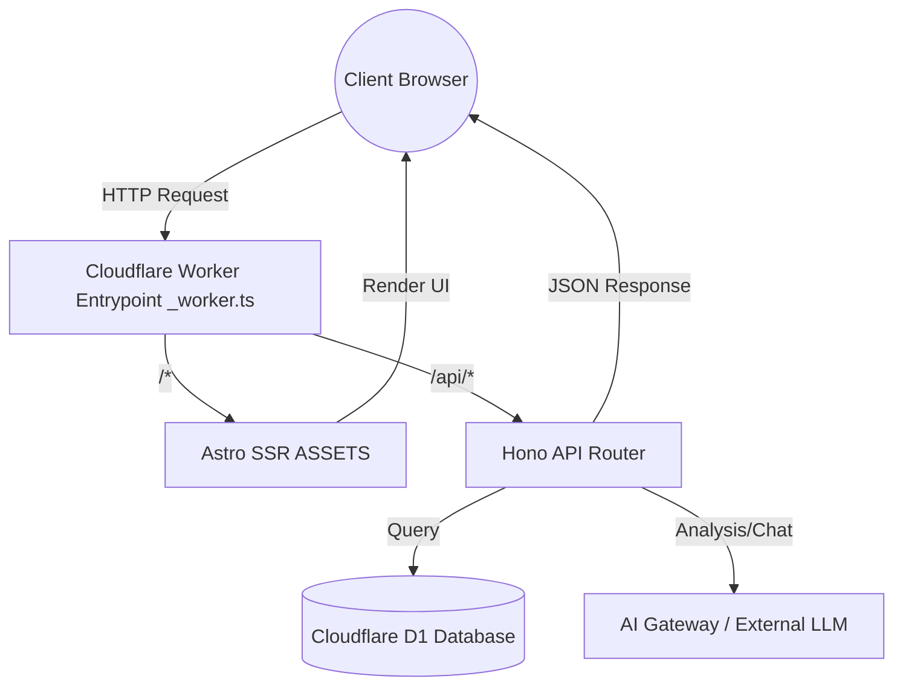

# ⚡️ Core Template CFW Assets

> The ultimate high-performance, AI-ready full-stack boilerplate deployed at the edge.

[](https://deploy.workers.cloudflare.com/?url=https://github.com/126colby/core-template-cfw-assets-astro-shadcn)
[](https://astro.build/)
[](https://hono.dev/)
[](https://workers.cloudflare.com/)

---

## What is Core Template CFW Assets?

Core Template CFW Assets is a next-generation boilerplate engineered to build incredibly fast, AI-powered applications natively on Cloudflare's global edge network. It seamlessly bridges a robust backend API powered by **Hono** with a lightning-fast, reactive frontend driven by **Astro**, **React**, and **shadcn/ui**.

Built for modern developers who crave rapid iteration without sacrificing architectural integrity, this template provides a complete stack right out of the box—from an edge SQLite database (D1) managed by Drizzle ORM, to integrated AI SDK support and comprehensive OpenAPI spec generation. It's not just a starter kit; it's a launchpad for your next big idea.

---

## Perfect For

### 🛠️ Solo Founders & Indie Hackers

Launch your MVP in record time with pre-configured UI components, database schemas, and AI integration, all seamlessly deploying to Cloudflare for scale-to-zero pricing.

### 🏢 Internal Dev Teams

Standardize your company's tooling with a robust, type-safe architecture. The integrated OpenAPI spec, Swagger docs, and modular Hono routing make collaboration and API consumption a breeze.

### 🤖 AI-First SaaS Platforms

Harness the power of the `@ai-sdk/react` and Cloudflare AI integrations built straight into the template to deliver responsive, intelligent features to your users with minimal latency.

---

## Key Features

- **⚡️ Edge-Native Performance:** Fully deployed on Cloudflare Workers, ensuring your API and Astro SSR frontend run globally close to your users.
- **🎨 Beautiful UI by Default:** Integrated with Tailwind CSS and shadcn/ui for accessible, highly customizable component design.
- **🗄️ Edge SQLite Database:** Powered by Cloudflare D1 and type-safe data modeling with Drizzle ORM.
- **🤖 Built-in AI Capabilities:** Pre-configured with `@ai-sdk/react` and multiple model API key supports (OpenAI, Anthropic, Gemini, Cloudflare AI Gateway).
- **📚 Automatic API Documentation:** Out-of-the-box OpenAPI specs, Swagger UI, and Scalar integrations via Hono.
- **🛡️ Strict Type Safety:** End-to-end TypeScript support and Zod validation for rock-solid reliable code.

---

## Tech Stack

**Built on Cloudflare's Platform:**

- **Frontend:** Astro, React, Tailwind CSS v4, shadcn/ui, Plate (rich text editing)
- **Backend:** Hono, Cloudflare Workers
- **Database & ORM:** Cloudflare D1, Drizzle ORM, Drizzle-Zod
- **AI & Integrations:** AI SDK, Assistant UI
- **Tooling:** Vite, Biome/Oxlint, Wrangler

---

## Programmatic Access

You can easily interact with the Hono API built into this template. Here is an example of calling a route from a client application:

```typescript
// Fetching projects via the internal Hono API
async function fetchProjects() {
  const response = await fetch("/api/projects", {
    method: "GET",
    headers: {
      "Content-Type": "application/json",
      // Ensure any required authentication headers are included
    },
  });

  if (!response.ok) {
    throw new Error("Failed to fetch projects");
  }

  const data = await response.json();
  console.log("Projects retrieved:", data);
  return data;
}

fetchProjects();
```

---

## Deployment Guide

### Quick Deploy Checklist

- [ ] Clone the repository and install dependencies (`pnpm install`).
- [ ] Configure `wrangler.jsonc` with your specific Cloudflare Account ID and bindings.
- [ ] Set up local database and run migrations (`pnpm run migrate:local`).
- [ ] Bind all required environment variables and secrets to your Cloudflare Worker.
- [ ] Execute `pnpm run deploy` to push the application to Cloudflare.

### Required API Keys

Depending on your application's focus, you'll need a subset of these keys bound as secrets using `npx wrangler secret put <SECRET_NAME>`.

### Configuration

| Variable/Secret Name    | Description                                            | Environment  |
| :---------------------- | :----------------------------------------------------- | :----------- |
| `DB`                    | Cloudflare D1 Database binding                         | Required     |
| `ASSETS`                | Cloudflare Workers Assets binding (used for Astro SSR) | Required     |
| `CLOUDFLARE_ACCOUNT_ID` | Your Cloudflare Account ID                             | Local / Prod |
| `CLOUDFLARE_API_TOKEN`  | API token for Cloudflare resource access               | Local / Prod |
| `OPENAI_API_KEY`        | Key for OpenAI models                                  | Optional     |
| `ANTHROPIC_API_KEY`     | Key for Anthropic Claude models                        | Optional     |
| `GOOGLE_API_KEY`        | Key for Google Gemini models                           | Optional     |
| `WORKER_API_KEY`        | Shared secret for internal API auth                    | Prod         |

---

## How It Works



---

## Deep Dive

### Architectural Highlight: The Unified Entrypoint

This template seamlessly merges a server-side rendered Astro application with a robust Hono API under a single Cloudflare Worker.

```typescript
// src/_worker.ts
import type { ExportedHandler } from "@cloudflare/workers-types";
import { app as honoApp } from "./backend/api/index";

const handler: ExportedHandler<Bindings> = {
  async fetch(request, env, ctx) {
    const url = new URL(request.url);

    // 1. Intercept API routes and docs, routing them to Hono
    if (
      url.pathname.startsWith("/api/") ||
      url.pathname === "/openapi.json" ||
      url.pathname.startsWith("/swagger")
    ) {
      return honoApp.fetch(request, env, ctx);
    }

    // 2. Fallback everything else to Astro's SSR handler via the ASSETS binding
    return env.ASSETS.fetch(request);
  },
};

export default handler;
```

---

## Local Development

1. **Clone the Repo**

   ```bash
   git clone https://github.com/126colby/core-template-cfw-assets-astro-shadcn.git
   cd core-template-cfw-assets-astro-shadcn
   ```

2. **Install Dependencies**
   Ensure you have Node.js and `pnpm` installed.

   ```bash
   pnpm install
   ```

3. **Database Setup**
   Generate the Drizzle schema and apply migrations locally.

   ```bash
   pnpm run migrate:local
   ```

4. **Run Development Server**
   Spin up the Astro development server.
   ```bash
   pnpm run dev
   ```
   Navigate to `http://localhost:4321`.

---

## Operations & Support

### Troubleshooting

- **`wrangler d1` migration fails:** Ensure your `wrangler.jsonc` has the correct `database_id` and `preview_database_id` configured for your D1 instance.
- **Port conflicts:** If `4321` is taken, Astro will automatically try the next port. Check your terminal output.
- **Missing Secrets:** During local development, ensure you have a `.dev.vars` file populated with local equivalents for the secrets defined in `wrangler.jsonc`.

### Security & Privacy

- All API routes should validate input using Zod via `@hono/zod-validator` (already pre-configured).
- Sensitive AI and infrastructure keys must be stored in Cloudflare Secrets, never hardcoded or committed to version control.
- Rate limiting is recommended for production deployments on public-facing `/api` endpoints.

### Contributing

1. Fork the repository.
2. Create a feature branch (`git checkout -b feature/amazing-feature`).
3. Ensure all checks pass by running `pnpm run check`.
4. Commit your changes (`git commit -m 'Add amazing feature'`).
5. Push to the branch (`git push origin feature/amazing-feature`).
6. Open a Pull Request.
